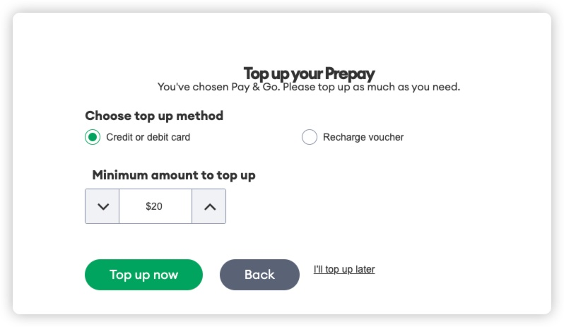

# 9 块钱申请一个新西兰手机号，最少可用 2 年

## 0. 卡信息  

申请的卡是 ONE NZ 运营商的，申请卡时需付费 2 NZD，大概是 8.7 人民币，不需要充值即可使用 720 天，然后每次至少充值 10 NZD，充值后有效期变为 360天，
建议首次申请后等待 720 天再充值。  

> 申请教程参考： https://docofcard.com/archives/one-nz-paygo/ ，我根据我自己的申请流程补充了一些内容，感谢原文作者。

## 1. 费用  
使用费用可参考官网内容： https://one.nz/legal/terms-conditions/casual-prepay-rates/  
总结：  
  

## 1. 申请流程  
官方地址： https://one.nz/prepay/  

进入地址后点击下方的 「Buy my SIM」  
  
然后点击下方你需要的号码，实体号码只能邮寄到新西兰地址，因为我有支持 esim 的手机，所以这里我选择了 esim，输入你的邮箱，邮箱一定要是自己常用的，后面接收
esim 二维码和注册账号都要用到。然后点击右下方的「Add to cart」添加到购物车。  
  
点击下方的同意后，点击「Checkout」。  

这里会让你填个人信息，邮箱还是填前面的邮箱，下面的电话随便填一个就行，就按照他给的模板填一个 021234567 也行，不会去做校验。  
然后点击下方的对勾继续。接下来会让你填信用卡信息来付款，我试了一下招行的 visa 卡是不能付款的，我用我自己的 zabank 就正常付款成功了。  
  
付款成功后会看到这个界面，然后等待邮件即可。会给你发三封邮件，第一封邮件中带了你的电话号和 esim 二维码，另外两封是账单信息，不用管。  

## 2. 激活卡  
我们用手机自带的相机扫描邮件中的二维码，会让你添加 esim 到手机中，点击添加会让你输入验证码，这个验证码就在邮件中二维码的下面。输入后没问题就能正常添加
到手机里了。  
添加到手机后会收到激活的短信，根据短信中的地址到官网激活。  
  
进入官网后会让你输入手机号，然后会发送验证码到手机上，填写验证码后按回车即可登录。  

然后会让你选择计划，这里我们选择下方的「I prefer to pay casual rates」。

然后会显示 pay go 的计划，点击下方的「Select this plan」。  

接下来这里会让你充值，这里可以选择下方的 「I'll top up later」跳过充值。

然后我们的激活程序就完成了，可以正常使用卡了。  

## 3. 注册 App  
在 App Store 中搜索 「my one nz」，第一个就是官方 App，或者点击[链接](https://apps.apple.com/us/app/my-one-nz/id370880990?l=zh-Hant-TW)。  

下载完打开 App 后我们选择 「register」，邮箱填刚才的邮箱，其他的信息随便填。然后我们会收到一封确认邮箱，点击邮箱中的链接即可确认。  

确认完后我们用刚才注册的邮箱和密码登录 App，登录时可以选择 「remember me」，否则下次登录还是需要填写账号密码。进入 App 后点击最上方的「Add service」，
填写你的手机号和验证码即可绑定手机，然后就可以在 App 内查看和充值了。
  
绑定成功后可能会显示无法加载内容，下拉刷新。但是我下拉刷新了几次都不行，还是要退出 App 重进。  

## 4. 充值

App 内最少充值 10 NZD，官网上最少充值 20 NZD。最好在即将过期的时候充值最划算，可以多延长一些时间，就算你不打算重置，那 2 NZD 买一张可以用两年的卡也
是比较划算的。

## 5. 开启 Wi-Fi calling  
[使用无线局域网通话功能拨打电话 - 官方 Apple 支持 (中国)](https://support.apple.com/zh-cn/108066)  
使用 Wi-Fi calling 可以不用话费接收短信，是一个非常实用的功能，这个卡开启 WiFi calling 也非常简单，在 setting - cellular - yourcard - Wi-Fi calling 中打开即可。
开启后可以在控制中心左上角看到 Wi-Fi calling 的标志。

