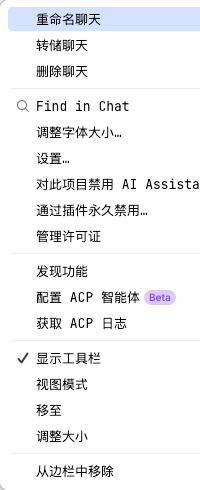

# IDE AI Assistant 可视化使用 Claude Code

🔗：https://linux.do/t/topic/1362218/58

作用：在 AI Assistant 中使用 Claude Code，不再使用命令行，防止内容过多命令行闪屏

```
{
    "agent_servers": {
        "Claude Code": {
            "command": "claude-code-acp"
        },
        "Codex": {
            "command": "npx",
            "args": [
                "@zed-industries/codex-acp"
            ]
        },
        "Gemini": {
            "command": "gemini",
            "args": [
                "--experimental-acp"
            ]
        }
    }
}
```

配置方式：

1. webstorm 的 AI Assistant 更新到最新版，点击选项



2. 配置 ACP 智能体
   1. Claude Code 使用命令行安装 `npm install -g @zed-industries/claude-ccode-acp`，codex 直接在配置文件中配置
   2. 重启 webstorm，打开 AI Assistant，在下面选择工具的地方就能选择 cc 了
   3. 这里的 cc 可以检测全局 cc 的 mcp 和 skills 配置，应该是连接了 cc，提供了一个可视化页面

问题：目前在某些项目中出现 cc 思考时间过长，不确定是连接断开了还是有其他问题，而且实用性感觉一般，因为竖屏看的话会遮挡一般代码区，待后续观察。
