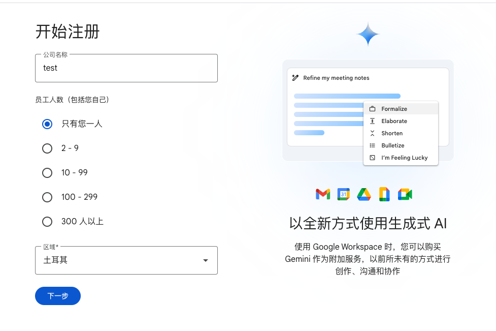
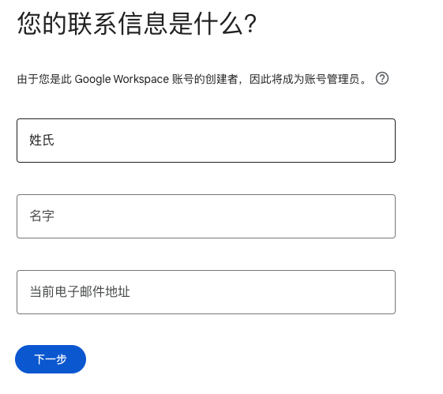
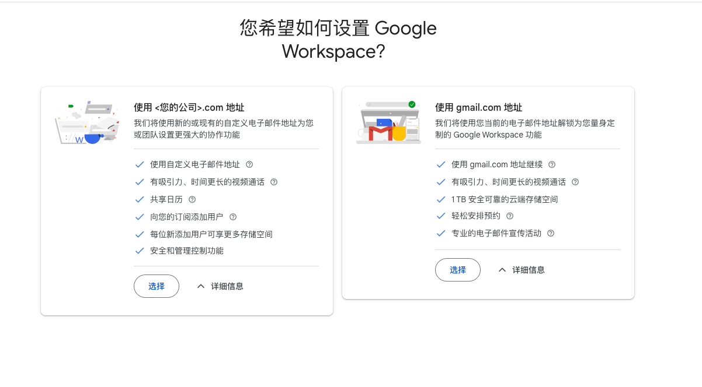
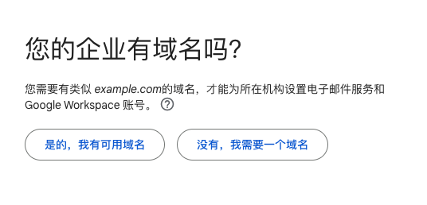
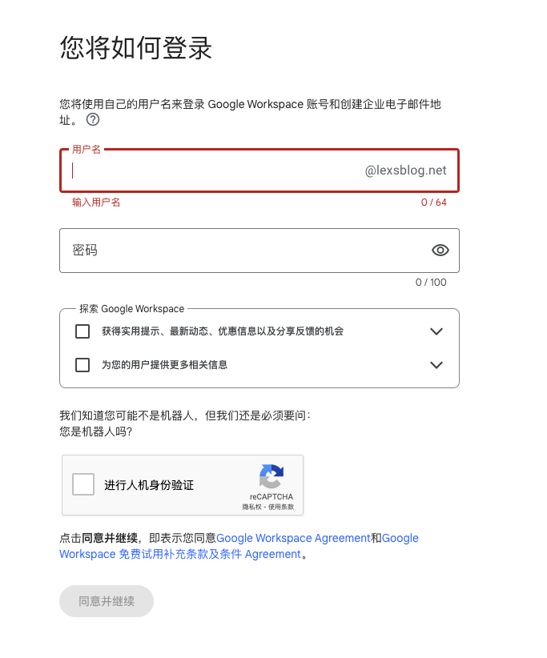

# 借用 Google Workspace 低价购买域名
Google domain 目前已经停止服务了，后续也会迁移到第三方服务商中。但是在 Google domain 中购买域名是真的便宜。
之前可以手动设置自己的国家为土耳其，就可以用土耳其的低价格来购买域名了，我记得我之前买的一个.com 域名，10 年只要 500 左右，今天又购买了一个 .org 的域名，9 年只要 150 块钱。

简而言之就是利用 Google Workspace ，在创建过程中选择购买新的域名，这时候使用土耳其区节点，依然可以使用 Google domain 服务来购买域名，价格还是土耳其区的价格。
## 1. 流程
- 打开你的代理工具，将节点切换为土耳其区，如果你的节点没有土耳其区，可以在 [毒药排行榜](https://www.duyaoss.com/) 中看一下评测，买一个便宜的机场服务。   
- 打开 [Google Workspace](https://workspace.google.com) 官网，点击右上角「开始免费试用」  
- 填写你的公司名称等信息（如果不打算常用 Workspace 就随便起名），公司人数选择 1 人（人数无所谓，因为最开始会有 14天免费试用，如果想体验 Workspace，可以注册完成后在订阅中试用其他服务，有个新手版试用期可以分配 10 个免费许可，服务的试用期是 30 天。Workspace 是不需要花钱的），区域选择土耳其  

- 点击下一步后填写联系信息，这里随便写，当前邮箱地址就填自己的 Gmail 邮箱

- 点击下一步后选择 **「使用 <您的公司>.com 地址」**  

- 然后选择「没有，我需要一个域名」  

- 接下来就可以搜索自己喜欢的域名了，因为 Google domain 的域名服务支持的域名不是很多，可以多准备几个备选方案，但是价格是挺便宜的。之前 .com 的涨过一次价，可以考虑 .org 或者 .net 的域名，便宜的 75 try/year ，折合人民币大概 16 块钱。  
- 选择好域名后，点击下一步，输入企业信息，土耳其地址可以在网上随便生成，电话也可以填非土耳其的电话，国内电话即可，不需要验证。  
- 在如何登录这个页面就已经可以使用自定义名称+域名的形式登录 Google Workspace 了，设置好用户名（可以设置 admin 等关键词）和密码，点击同意并继续。  

- 接下来一定会让你进行手机号验证，这次的手机号验证和上一次的不同，这次是要接收到验证码才能验证通过的，可以考虑使用国内的手机号，但是国内不保证能接到短信，尽量使用国外的。没有的话接码平台了解一下？  
- 验证通过之后就进入到绑定信用卡和结算的页面，这里显示只能域名只能 1 年付，但是我们可以在后面用别的方法来直接付费 10 年。下面填上你的信用卡信息，我用的是招行的 visa 卡，可以正常付款。  
- 没有问题的话应该就能使用之前填写的账号密码登录 Workspace 的后台的，这里没什么好说的，可以先把 [订阅](https://admin.google.com/u/3/ac/billing/subscriptions)，中的域名续费取消掉。  
- 接下来就是一次性续费域名了，我们进入到 [Google domain](https://domains.google.com/registrar) 网站，点击右上角「登录」，使用刚才的账号密码登录（不是你的谷歌账号，是你的域名邮箱的账号密码，这里我傻了，找了好长时间没找到）。  
- 这里提示不能购买新域名，但是因为我们之前已经买好域名了，可以直接点击 我的域名 - 管理 - 注册设置 - 往下拉点击添加年限 - 选择你想续费的时长，价格就是按照注册价格 * 年限计算的。这里需要重新绑定信用卡，正常正常付费在 whois 中就能查到信息。  
- 如果想把域名转移到 CloudFlare 等第三方服务商，续费的时候选择 8 年，根据教程直接转移就行。如果只是想把 DNS 转到 CloudFlare，在 DNS 设置中选择自定义域名服务器，在 CloudFlare 中添加域名，然后根据设置填写域名服务器即可。  
- 最后去 Workspace 的结算中取消掉 Workspace 的订阅，这样就不会再产生费用了。

