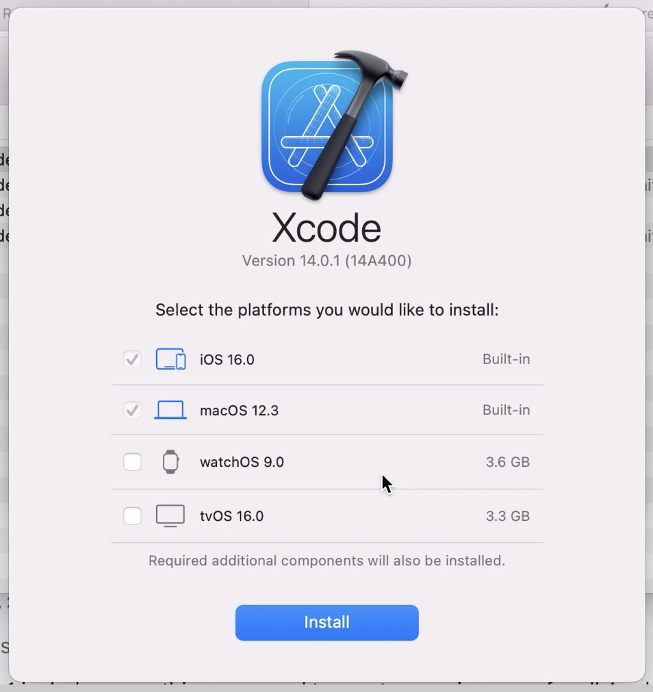
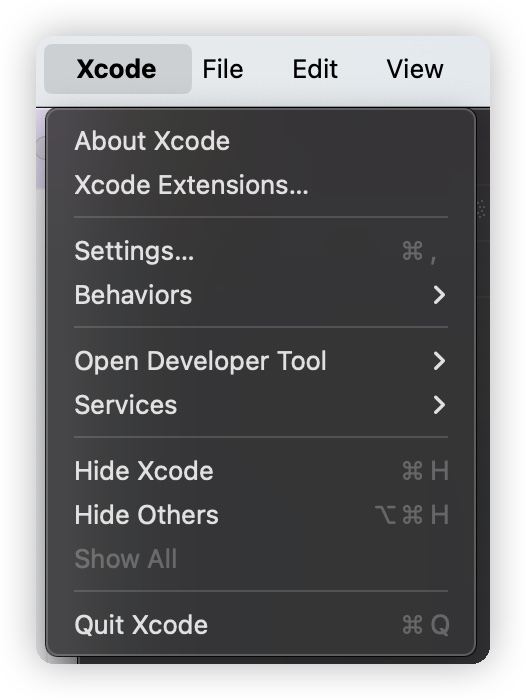
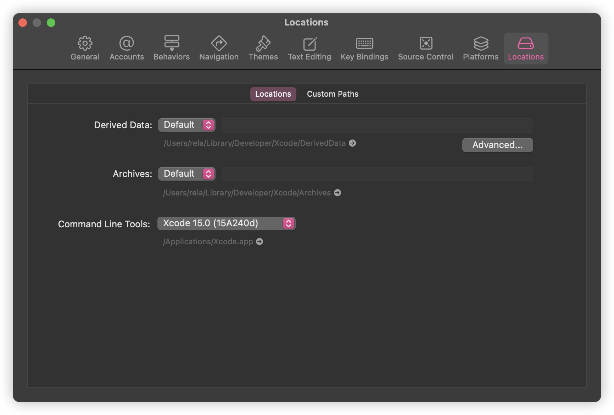
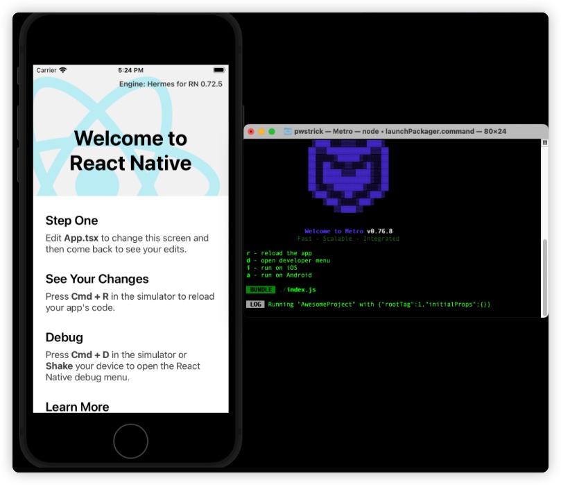

# macOS 安装 React Native 环境
--- 

## 0. 背景
最近公司想让我们组用 React Native 来做一个 APP，之前也只是听说过有这么个框架，也没实际了解过，正好趁这个机会学一学新技术。  
## 1. 安装 Homebrew  
可以参考[官网](https://brew.sh/zh-cn/)，或者直接使用下面的命令安装：  
```shell
/bin/bash -c "$(curl -fsSL https://raw.githubusercontent.com/Homebrew/install/HEAD/install.sh)"
```  
因为众所周知的问题，在国内直接使用 brew 官网源安装包可能会安装不上，这里我推荐使用中科大的源，我自己使用了好几年都没有啥问题。使用下面的命令切换源：
```shell
export HOMEBREW_BREW_GIT_REMOTE="https://mirrors.ustc.edu.cn/brew.git"
brew update
```  
重置为官方源：
```shell
unset HOMEBREW_BREW_GIT_REMOTE
git -C "$(brew --repo)" remote set-url origin https://github.com/Homebrew/brew
```  
也可以使用国人制作的中文安装脚本，直接安装并切换源。可以参考下面的文章：  
[Homebrew国内如何自动安装（国内地址）（Mac & Linux）](https://zhuanlan.zhihu.com/p/111014448)
  
## 2. 安装 Node.js
可以使用 brew 直接安装 node：  
```shell
brew install node
```  
### 3. 安装 Watchman
Watchman 是一个监视文件系统变更的工具，可以在文件发生变化时自动重新编译。  
同样，我们使用 brew 安装：  
```shell
brew install watchman
```
安装完成后执行命令：  
```shell
watch --version
```
如果能正常输出版本号，说明安装成功。  
### 4. 安装 Ruby  
Mac 默认安装了 Ruby，但是版本比较低，我们需要安装一个新版本的 Ruby。  
```shell
brew install rbenv ruby-build
```  
安装完成后，执行 `rbenv init` ，会提示将 init 命令添加至默认 shell 的配置文件中，这里我使用的是 zsh，所以我需要执行下面的命令添加至 `~/.zshrc` 中：  
```shell
echo 'eval "$(rbenv init - bash)"' >> ~/.zshrc
```
然后我们重启 shell，执行下面命令来安装 Ruby：
```shell
rbenv install 3.2.2
```
安装完成后再次重启 shell，执行 `ruby -v`，如果能正常输出版本号为 3.2.2，说明安装成功。  
```shell
$ ruby --version
ruby 3.2.2 (2023-03-30 revision e51014f9c0) [x86_64-darwin21]
```  
### 5. Gem 和 Bundler  
Gem 是 Ruby 的包管理工具，Bundler 是 Gem 的扩展，可以帮助我们管理项目中的 Gem 包。  
执行命令切换源：
```shell
$ gem sources --add https://gems.ruby-china.com/ --remove https://rubygems.org/
$ gem sources -l
https://gems.ruby-china.com
```
切换 Bundler 源的方式是通过设置 config：
```shell
bundle config mirror.https://rubygems.org https://gems.ruby-china.com
```  
### 6. 安装 CocoaPods  
CocoaPods 是一个管理 iOS 项目依赖的工具，我们可以使用它来管理 React Native 项目的依赖。  
```shell
sudo gem install cocoapods
```  
安装完成后执行下面命令确定是否安装成功：
```shell
pod --version
```  
这里我碰到了问题了：  
```shell
/usr/local/lib/ruby/gems/3.2.0/gems/activesupport-7.1.0/lib/active_support/core_ext/array/conversions.rb:108:in `<class:Array>': undefined method `deprecator' for ActiveSupport:Module (NoMethodError)

  deprecate to_default_s: :to_s, deprecator: ActiveSupport.deprecator
                                                          ^^^^^^^^^^^
Did you mean?  deprecate_constant
        from /usr/local/lib/ruby/gems/3.2.0/gems/activesupport-7.1.0/lib/active_support/core_ext/array/conversions.rb:8:in `<top (required)>'
        from <internal:/usr/local/lib/ruby/site_ruby/3.2.0/rubygems/core_ext/kernel_require.rb>:86:in `require'
        from <internal:/usr/local/lib/ruby/site_ruby/3.2.0/rubygems/core_ext/kernel_require.rb>:86:in `require'
        from /usr/local/lib/ruby/gems/3.2.0/gems/cocoapods-1.13.0/lib/cocoapods.rb:9:in `<top (required)>'
        from <internal:/usr/local/lib/ruby/site_ruby/3.2.0/rubygems/core_ext/kernel_require.rb>:86:in `require'
        from <internal:/usr/local/lib/ruby/site_ruby/3.2.0/rubygems/core_ext/kernel_require.rb>:86:in `require'
        from /usr/local/lib/ruby/gems/3.2.0/gems/cocoapods-1.13.0/bin/pod:36:in `<top (required)>'
        from /usr/local/bin/pod:25:in `load'
        from /usr/local/bin/pod:25:in `<main>'
```
经过[搜索后](https://github.com/CocoaPods/CocoaPods/issues/12080#issuecomment-1750798854)得知这个问题是因为 activesupport 版本太高导致的，我们可以使用下面的命令降低 Ruby 版本：  
```shell
sudo gem uninstall activesupport
sudo gem install activesupport --version 7.0.8
```
### 7. 安装 Xcode  
安装 xCode 可以直接在 App Store 下载安装，如果碰到 Mac 版本问题导致无法从 App Store 安装可以从[官网](https://developer.apple.com/download/all/?q=xcode)下载安装包安装。  
进入网站后登录你的 Apple ID，然后选择对应版本的 Xcode 下载。  
  
然后等待下载完成即可。  
下载完成后我们打开 xCode，在左上角打开 `Settings`，然后选择 `Locations`，在 `Command Line Tools` 中选择对应的版本。  

  
**注意⚠️：如果你是第一次打开可能会在选项框里看到已经有对应的配置了，但是还是要点开选项框选择一下，如果不操作会默认没有。**
### 8. 新建项目  
我们可以使用 React Native 官方提供的命令来新建项目：  
```shell
npx react-native init AwesomeProject


                  Welcome to React Native!
                 Learn once, write anywhere

✔ Downloading template
✔ Copying template
✔ Processing template
✔ Installing Ruby Gems
✖ Installing CocoaPods dependencies (this may take a few minutes)
error bundler: failed to load command: pod (/Users/pwstrick/code/rnative/AwesomeProject/vendor/bundle/ruby/3.2.0/bin/pod)
/Users/pwstrick/code/rnative/AwesomeProject/vendor/bundle/ruby/3.2.0/gems/activesupport-7.1.0/lib/active_support/core_ext/array/conversions.rb:108:in `<class:Array>': undefined method `deprecator' for ActiveSupport:Module (NoMethodError)

  deprecate to_default_s: :to_s, deprecator: ActiveSupport.deprecator
```
安装过程中又碰到了之前的问题，还是在刚刚的 issue 中找到了[解决方案](https://github.com/CocoaPods/CocoaPods/issues/12080#issuecomment-1751675213)  
进入到项目文件夹中，编辑 Gemfile 文件，在文件中增加一行配置：
```
gem 'activesupport', '~> 7.0.8' 
```  
然后执行下面的命令安装依赖：  
```shell
cd IOS  // 打开 iOS 文件夹
bundle install  // 安装 Bundle
bundle update activesupport  // 更新支持
bundle exec pod install  // 安装 CocoaPods 依赖
```  
中间可能要等待很长时间，我安装是等待了大概 10分钟，倒是没有碰到网络报错，就是装的慢，可以多等等。  
### 9. 启动项目  
我们直接在 shell 中用命令启动项目：
```shell
npx react-native run-ios
```  
等待编译完成后就可以弹出来一个模拟器了，这里默认是 iPhone SE 3，可以在启动命令中选择手机型号：
```shell
npx react-native run-ios --simulator="iPhone 15 pro"
```  
  
我也尝试了在 xCode 中编译项目，但是一直编译报错，目前还没有找到解决方案，不过项目已经是可以正常启动，也可能热重载了。  
  
至此，我们已经成功安装了依赖并启动项目了。
