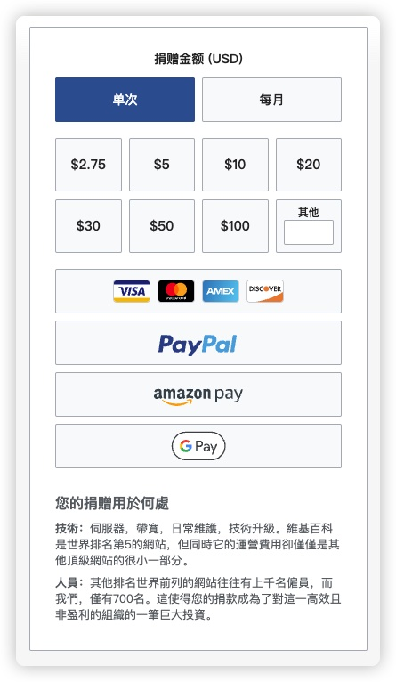
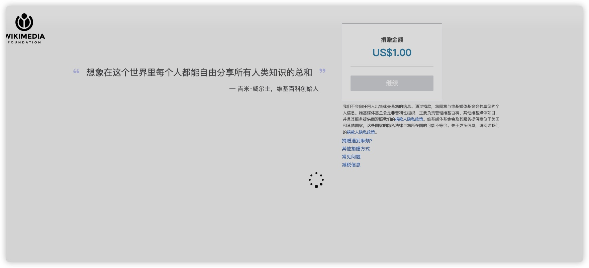
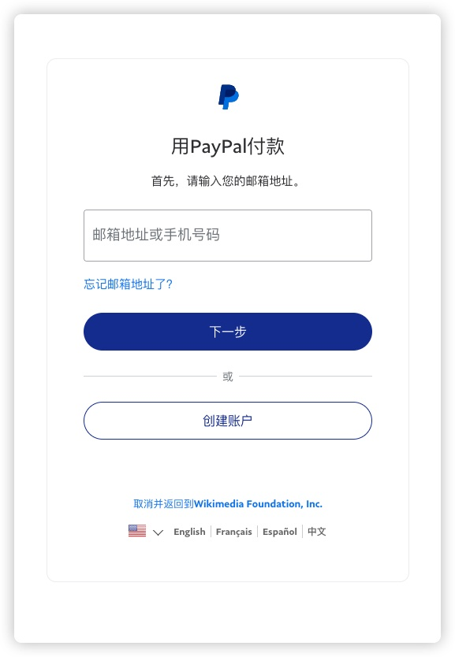
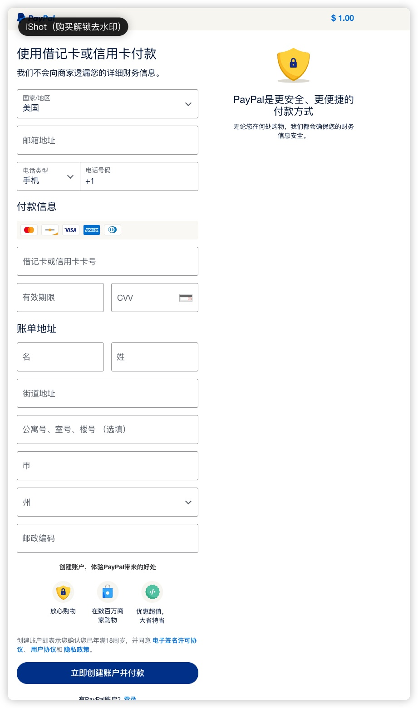

# 借用维基百科使用 Google Voice 开通美区 PayPal  

---
### 0. 背景  
因为我把自己主力的 Apple ID 切换到了美区，支付就是一个问题。虽然可以采用在官网购买礼品卡充值支付的方式曲线救国，但是礼品卡是不支持自动续费的，所以还是需要绑定一个支付方式的。  
因为美国信用卡的开通是有一些成本的（包括时间和金钱），虽然现在也有很多用 USDT 开通的美国信用卡，但是手续费也是不低的，那算下来就只剩 PayPal 了。  
前几年还是可以直接用 Google voice 开通的，但是最近限制严格了，直接在官网上注册会提示不支持虚拟电话卡。淘宝上也可以购买一些美国的实体卡，但是价格贵，保号成本高。  
### 1. 直接开始  
首先我们进入维基百科的[捐款页面](https://donate.wikimedia.org/w/index.php?title=Special:LandingPage&country=US&uselang=zh&utm_medium=spontaneous&utm_source=fr-redir&utm_campaign=spontaneous&retried=1)，尽量使用美国节点，因为官网说明了新加坡和日本地区不接受 PayPal 捐款，而我在使用香港节点的时候是没有 PayPal 选项的。  
  
如果你能在右边的捐款选项中看到 PayPal 的选项，那就说明你的节点没有问题，我们可以继续下一步，否则需要切换节点再次尝试。可以使用浏览器的无痕方式打开，防止页面缓存。  
或者你可以查看你的浏览器地址：
`https://donate.wikimedia.org/w/index.php?title=Special:LandingPage&country=US&uselang=zh-hans`  
如果你切换到了美区节点，但是地址中`country`的值不是`US`，你可以尝试手动修改为 US。  
捐款金额因人而异，我这里选择了 1 美元，然后点击 PayPal 按钮。  
  
中间会进入这样一个中间页，会自动点击捐款并跳转，如果没有跳转，可以手动点击。  
  
然后就会进入 PayPal 的登录页面，这里我们选择创建用户。  
  
这个页面我们就正常输入自己的信息，电话就可以输入自己的 gv 号啦，下方的地址可以搜索`美国地址生成`来生成一些地址，尽量选择免税州的地址。  
  
> 美国免税州地址  
> 阿拉斯加州（Alaska）、特拉华州（Delaware）、蒙大拿州（Montana）、新罕布什尔州（New Hampshire）、俄勒冈州（Oregon）  
  
银行卡可以使用国内银行发行的 Visa、MasterCard、American Express 等不同组织的卡片，但是需要开通海外无卡支付。  
输入完成后点击下方`立即创建账号并支付`即可直接捐款 1 美元，这时候你的邮箱应该也收到了 PayPal 的邮件。  
然后我们进入 PayPal 的网站[登录账户](https://www.paypal.com/signin)，输入刚刚创建的账户，然后点击`下一步`。  
在输入密码的下方找到`忘记密码`，点击进入密码重置页面。在页面中会让你创建密码，输入两次新密码即可。  
然后我们就得到了一个美区的 PayPal 账户啦🎉，我们可以使用这个账户绑定美区 Apple ID 来进行支付。  
### 2. 一些注意事项  
- 由于 PayPal 的严格风控问题，尽量不要使用 PayPal 去支付一些可以直接使用银行卡支付的网站。  
- 可以在翻墙软件的规则中加入 PayPal，给 PayPal 单独设置一个固定的节点，防止节点乱飘被风控。  
- 可以使用 wise 的美区账户绑定 PayPal，可以解除一部分金额限制。（有机会写一写关于 wise 的内容）  
- 尽量少做高风险操作，尽量少在有风险账户中存大量余额。（包括但不限于非国区 App Store，非国区 PayPal）  
- 可以尝试使用护照进行身份认证，但有可能让上传地址证明，非必要不操作。  

## 账号有价数据无价，多一份备份总好过少一份备份。

